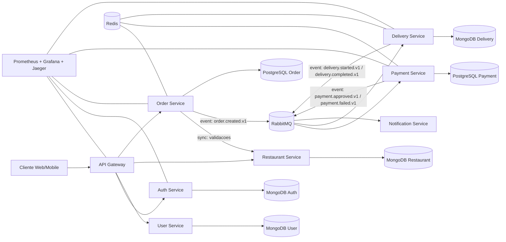
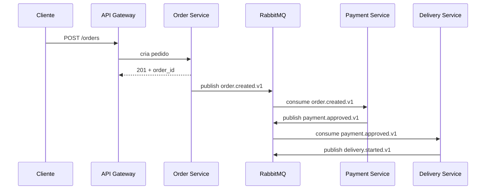
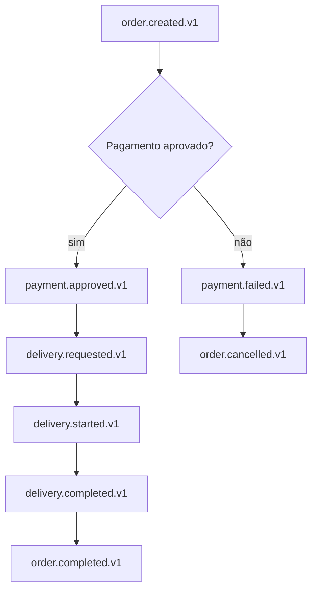
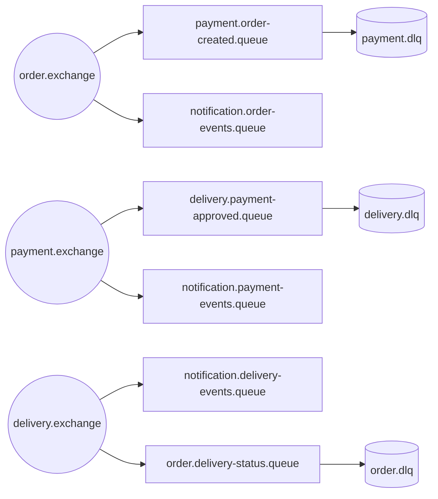

# Food Delivery Platform

<div align="center">

### Arquitetura Distribuida para um Sistema de Delivery Moderno

Projeto de estudo avancado em engenharia backend com foco em microsserviços, arquitetura orientada a eventos, resiliência e observabilidade.


</div>

---

## Visão Geral

A **Food Delivery Platform** e um laboratorio de arquitetura distribuida inspirado em cenarios reais de produtos como iFood e Uber Eats.

O objetivo não e construir apenas endpoints, mas exercitar os desafios de sistemas backend modernos:

- decomposicao por dominio em microsserviços
- comunicação síncronae assíncronaentre serviços
- consistencia eventual com fluxo orientado a eventos
- resiliência a falhas parciais
- observabilidade ponta a ponta
- escalabilidade horizontal por responsabilidade

Este repositorio representa uma **jornada técnica completa**, deixando claro o que ja existe, o que esta em evolução e o que esta planejado para as proximas iteracoes.

---

## Objetivos Técnicos

- Construir uma plataforma de delivery baseada em **microsserviços independentes**
- Aplicar **Event-Driven Architecture** com RabbitMQ
- Evoluir fluxo de pedidos com **Saga Pattern**
- Implementar mecanismos de resiliência: retry, DLQ e idempotencia
- Aplicar **Clean Architecture** e separação de camadas
- Instrumentar observabilidade com logs, métricas e tracing distribuido
- Explorar concorrencia em Go com worker pools e processamento assincrono

---

## Stack Tecnologica

| Camada | Tecnologias |
|---|---|
| Backend | Go |
| Banco de Dados | MongoDB + PostgreSQL (por dominio) |
| Mensageria | RabbitMQ |
| Cache Distribuido | Redis |
| API | REST (gRPC planejado) |
| Infraestrutura | Docker, Docker Compose, Kubernetes (em estruturacao) |
| Observabilidade | Prometheus, Grafana, Jaeger |
| Autenticacao | JWT + Refresh Token |

---

## Arquitetura Geral



### Principios arquiteturais

- Cada serviço possui responsabilidade clara e autonomia de deploy.
- Cada dominio evolui com baixo acoplamento entre contextos.
- Integracoes criticas usam mensageria para reduzir dependencia temporal.
- Escalabilidade pode ocorrer por serviço e por tipo de workload (API vs consumer).

---

## Comunicação Entre Serviços

### Síncrona(REST/gRPC)

Usada quando o retorno imediato e necessario:

- autenticacao/autorizacao
- consultas rapidas de apoio ao fluxo
- validacoes de regras com resposta em tempo real

### Assíncrona(RabbitMQ)

Usada para workflows distribuidos:

- propagação de eventos de dominio
- desacoplamento entre produtores e consumidores
- tolerancia a indisponibilidade momentanea



---

## Fluxo de Pedido (Order Lifecycle)



### Eventos de referência

- `order.created.v1`
- `payment.approved.v1`
- `payment.failed.v1`
- `delivery.started.v1`
- `delivery.completed.v1`
- `order.completed.v1`

---

## Topologia de Eventos no RabbitMQ



### Por que RabbitMQ neste contexto

- roteamento flexivel por exchange e routing key
- suporte natural a retry, nack e DLQ
- desacoplamento entre velocidade de produção e consumo
- base adequada para evoluir contratos de evento versionados

---

## Serviços Planejados

| Serviço | Responsabilidade principal | Estado |
|---|---|---|
| Auth Service | Identidade, JWT, refresh, revogacao de sessao | Em desenvolvimento avancado |
| User Service | Perfil, dados do usuario, historico | Planejado |
| Restaurant Service | Catalogo, cardapio, disponibilidade | Planejado |
| Order Service | Orquestracao do fluxo de pedido e saga | Planejado |
| Payment Service | Processamento e status de pagamento | Planejado |
| Delivery Service | Esteira de entrega e tracking | Planejado |
| Notification Service | Notificacoes por evento | Planejado |
| API Gateway | Entrada unica, auth e roteamento | Em estruturacao |

---

## Estrategia de Persistencia (decisao atual)

Depois de avaliar os trade-offs da arquitetura e buscando aproximar o projeto de um cenario real, cheguei a conclusao de que nao vale usar MongoDB para tudo.

Minha decisao atual:

- MongoDB em dominios com schema mais flexivel e evolucao rapida: `auth-service`, `user-service`, `restaurant-service`, `delivery-service` e `notification-service`.
- PostgreSQL em dominios com necessidade maior de consistencia transacional e auditoria: `order-service` e `payment-service`.

Motivos da decisao:

- `payment-service` lida com operacoes financeiras e exige maior rigor transacional e rastreabilidade.
- `order-service` possui transicoes de estado criticas do ciclo de pedido e se beneficia de integridade relacional.
- Dominios de perfil, catalogo e notificacao seguem adequados ao modelo documental do MongoDB.

Observacao importante:

- O projeto continua incremental e educacional. Esta decisao melhora aderencia a praticas de mercado sem perder o foco de aprendizado.

---

## Decisões Técnicas e Conceitos Aplicados

### Clean Architecture

Separação em camadas (`domain`, `application`, `infrastructure`, `delivery`) para reduzir acoplamento e preservar regras de negocio.

### Event-Driven Architecture

Mudanças de estado importantes geram eventos de dominio, permitindo evolução desacoplada entre serviços.

### Saga Pattern (em evolução)

Fluxo de pedido modelado como transacao distribuida por etapas, com caminho de compensacao para falhas.

### Worker Pool e concorrencia em Go

Consumidores podem processar mensagens em paralelo com controle de throughput e isolamento por fila.

### Cache distribuido

Redis como acelerador de leitura e apoio a workloads de alta frequencia.

---

## Observabilidade

A observabilidade e tratada como requisito de arquitetura, não como etapa final.

### Logs estruturados

- logs em formato consistente
- campos de rastreabilidade (`request_id`, `correlation_id`, `service`, `event_name`)
- suporte a auditoria de fluxo distribuido

### Tracing distribuido

- propagação de contexto entre API e consumidores
- spans por operacao critica
- rastreamento de latencia cross-service com Jaeger

### Métricas e monitoramento

- métricas de API e filas com Prometheus
- dashboards no Grafana
- foco em SLI/SLO de latencia, erro e backlog

---

## Resiliência e Escalabilidade

### Estrategias de resiliência

- **Retry Strategy** com backoff para falhas transientes
- **Dead Letter Queue (DLQ)** para mensagens não processaveis
- **Idempotencia** para evitar efeitos duplicados em reentregas
- timeouts e isolamento de falha entre serviços

### Escalabilidade horizontal

- replicas independentes por microsserviço
- escala orientada a carga (API e consumers)
- desacoplamento por filas para absorver picos

---

## Estrutura de Pastas

```txt
food_delivery_platform/
  api-gateway/
  deploy/
    compose/
    docker/
    kubernetes/
  docs/
    planning/
  scripts/
  services/
    auth-service/
      cmd/api/
      internal/
        application/
        config/
        delivery/http/
        domain/
        infrastructure/
    user-service/
    restaurant-service/
    order-service/
    payment-service/
    delivery-service/
    notification-service/
  shared/
    broker/
    contracts/
    errors/
    events/
    logger/
    middleware/
    utils/
```

---

## Status Atual

### Já implementado

- base compartilhada em `shared` com contratos, eventos, broker, middlewares e logger
- fundamentos do `auth-service` com casos de uso, handlers HTTP e testes
- organização de arquitetura por serviços e planejamento tecnico por dominio

### Em desenvolvimento

- consolidação do `api-gateway`
- evolução de seguranca e observabilidade no auth-service
- definicao dos contratos inter-serviços para os proximos dominios

### Planejado

- implementação dos serviços de pedido, pagamento, entrega e notificacao
- fluxo completo da saga de pedidos com compensacoes
- gRPC para caminhos criticos entre serviços
- hardening de resiliência e testes fim a fim

---

## Roadmap de Evolução

| Fase | Escopo | Status |
|---|---|---|
| Fase A | Fundacao compartilhada + Auth + Gateway inicial | Em progresso |
| Fase B | Restaurant + Order (happy path) | Planejado |
| Fase C | Integracao Payment + Delivery por eventos | Planejado |
| Fase D | Notification + compensacoes da saga | Planejado |
| Fase E | Observabilidade avancada, performance, chaos/resilience tests | Planejado |

---

## Direção Técnica

Este projeto segue uma direção clara: construir uma plataforma de delivery com padroes reais de engenharia backend, priorizando **desacoplamento**, **visibilidade operacional** e **evolução segura em ambiente distribuido**.

Mesmo durante a fase de estudo, cada incremento e pensado para refletir decisões utilizadas em sistemas de produção.

---

## Como acompanhar a evolução

- Planejamento de implementação: `docs/planning`
- Detalhes de auth: `services/auth-service/README.md` e `services/auth-service/TODO.md`
- Componentes compartilhados: `shared/`

---

## Licença

Projeto de estudo e laboratorio tecnico para fins educacionais.
